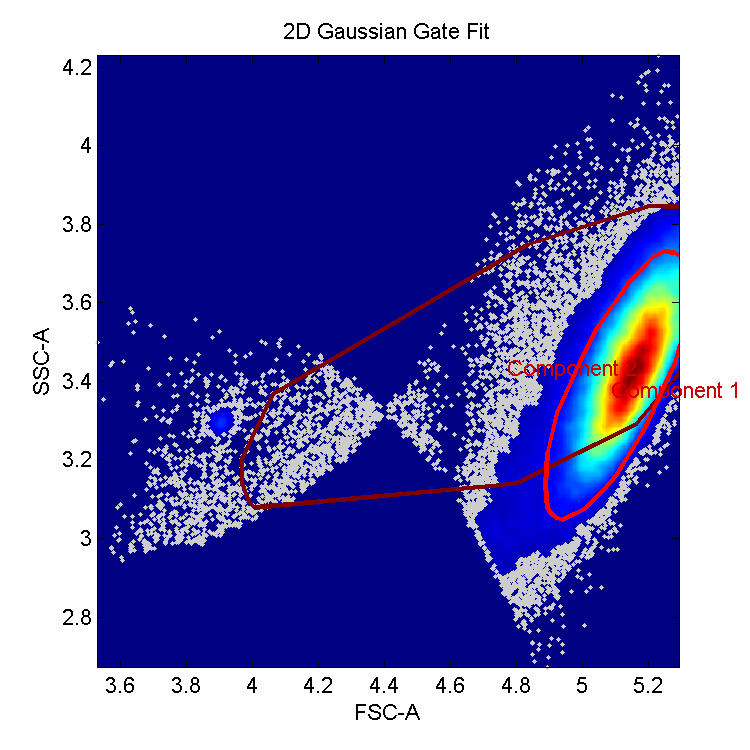
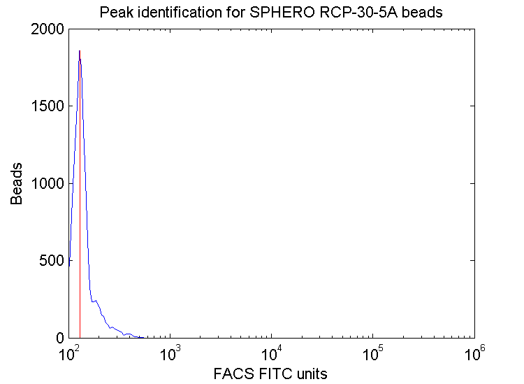
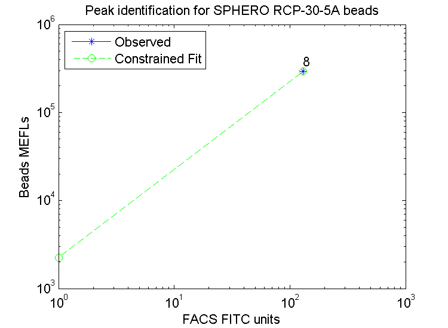
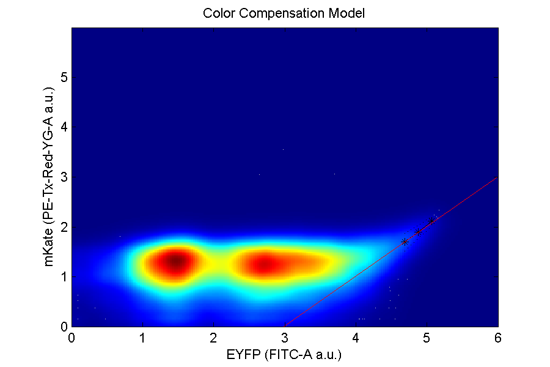
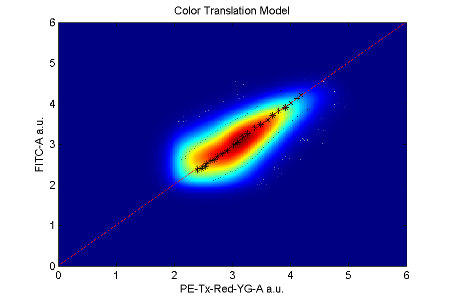

# ColorModels 

 This tutorial explains the process of building a ColorModel using the TASBEFlowAnalytics software package. A ColorModel improves the precision of flow cytometry measurements by translating raw fcs data into comparable unit data.

 ColorModels can be created either with the [Excel Interface](docs/Excel_README.md) or with the ```make_color_model.m``` [MATLAB script](https://github.com/TASBE/TASBEFlowAnalytics-Tutorial/blob/master/template_colormodel/make_color_model.m).      

## Autogating
The following code segment initializes Autogating.
```
AGP = AutogateParameters();
AGP.k_components = 2;
AGP.channel_names = {’FSC-A’, ’SSC-A’};
autogate = autodetect_gating(blankfile,AGP,’plots’);
```
Line 1 involves initializing the autogating filters. Line 2 corresponds to the number of searched Gaussian components. The default is 2 (first component is a single-cell component, while the second component is a non-cell/ clump component). The default channel names are FSCA,SSCA,FSCH,FSCW,SSCH,SSCW. Once the parameters are set, Autogating is initialized in line 4. Inputs include the location of the blankfile, the parameters, and the output directory where graphical figures will be stored.     

## Channels and ColorPairs
A useful function of the TASBEFlowAnalytics package is its use of multi-color controls to convert other colors into MEFL units. In order to begin this process, channels are created for each color being measured.

An example of this is below.
```
channels = {}; colorfiles = {};

channels{1} = Channel(’FITC-A’, 488, 515, 20);
colorfiles{1} = [stem0312 ’EYFP_P3.fcs’];
channels{1} = setPrintName(channels{1}, ’EYFP’);
channels{1} = setLineSpec(channels{1}, ’y’);

channels{2} = Channel(’PE-Tx-Red-YG-A’, 561, 610, 20);
colorfiles{2} = [stem0312 ’mkate_P3.fcs’];
channels{2} = setPrintName(channels{2}, ’mKate’);
channels{2} = setLineSpec(channels{2}, ’r’);

channels{3} = Channel(’Pacific Blue-A’, 405, 450, 50);
colorfiles{3} = [stem0312 ’ebfp2_P3.fcs’];
channels{3} = setPrintName(channels{3}, ’EBFP2’);
channels{3} = setLineSpec(channels{3}, ’b’);
```
As shown above, there are three channels being created, FITC-A, PE-Tx-Red-YG-A, and Pacific Blue-A. Each channel requires a name, wavelength, center filter, and width filter. Additional functions exist to add details by which a channel can be identified. For example, ```setPrintName``` and ```setLineSpec``` are used to set the channel names and colors.

After creating the channels, colorpairfiles are constructed to specify which colors are being converted.
```
colorpairfiles = {};

colorpairfiles{1} = {channels{1}, channels{2}, channels{3}, [stem0312 ’ mkate_EBFP2_EYFP_P3.fcs’]};
colorpairfiles{2} = {channels{1}, channels{3}, channels{2}, [stem0312 ’ mkate_EBFP2_EYFP_P3.fcs’]};
```
Line 3 shows an example of creating a color pairing. The first two parameters are the colors (FITC-A and PE-Tx-Red-YG-A) which are being converted into one another. The third parameter is an alternate color (Pacific Blue-A), which is used to estimate the conversion.

## Creating the ColorModel
Once the necessary inputs have been created, the ColorModel can be executed and saved.
```
CM = ColorModel(beadfile, blankfile, channels, colorfiles, colorpairfiles);
CM=resolve(CM, settings);
save(’-V7’,’CM120312.mat’,’CM’);
```  
More details regarding the beads can be specified with the functions, ```set_bead_model```, ```set_bead_batch```, and ```set_bead_peak_threshold```.  


## Output Graphs
After running the model, a series of graphs will be saved in a plots directory located in the same location as the Excel Interface or Matlab script. 



**Autogating graph**: visualization of the side scatter vs. the forward scatter. Two main components searched include a main cluster of cells and a non-cells cluster. Component 1 points towards the cell cluster, while component 2 corresponds to debris identified as the non-cell component.  


**Autofluorescence graph for PE-Tx-Red-YG-A channel**: a bell curve with a maximum at around 0 is expected. If a majority of the curve exists below 0, then it could be due to high autofluorescence within the cells. Alternatively, a widespread curve could imply instrument error.



**Bead peak identification graphs**: created for each channel.



**Bead fit curve**: if observed points do align with the constrained fit, then bead peaks may not have been accurately identified.





**Compensation and translation graphs**: denote the rate of separation from one color to another. 

#### If any issues are encountered during the installation process, report them using the <a href="https://github.com/TASBE/TASBEFlowAnalytics/issues">Github Issue Tracker</a>.