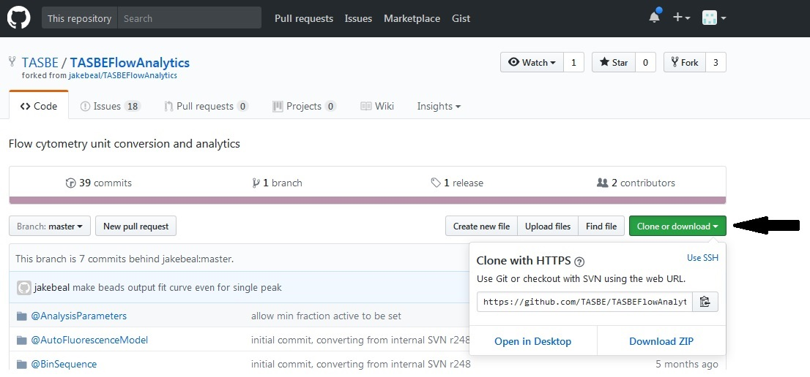
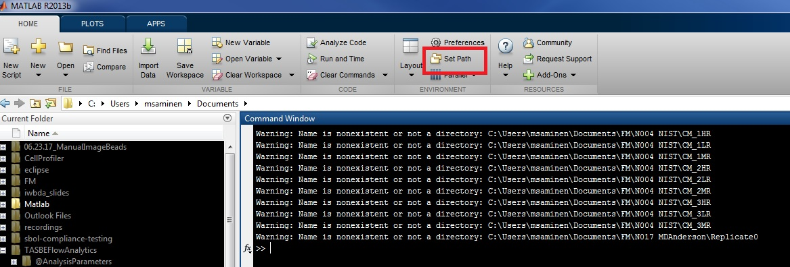
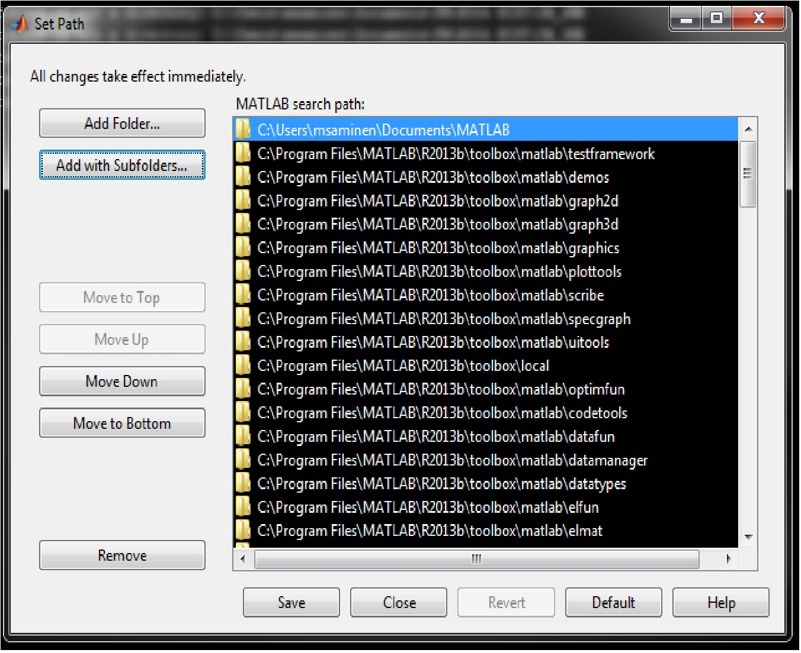
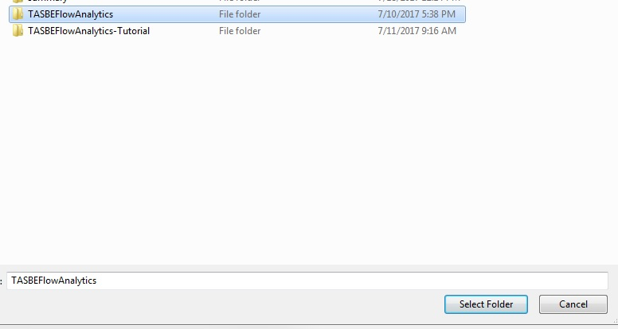

# Installation 

 This page provides a starting guide for users to setup the TASBEFlowAnalytics package in Matlab.

## Installing TASBEFlowAnalytics

 A Matlab version of R2015a or higher is recommended for TASBEFlowAnalytics. The code can be installed <a href="https://github.com/TASBE/TASBEFlowAnalytics">here</a>.

 There are two possible ways of retrieving the software. 
1. Download the software repository by extracting the contents from the zip directory. 
2. Install with Git Bash
```
git clone https://github.com/TASBE/TASBEFlowAnalytics
```



## Setting up a Matlab/Octave Environment
After installing TASBEFlowAnalytics, the next step involves importing the package into Matlab/Octave. There are several ways to accomplish this.
1. In Apple OSX or GNU/Linux shell:
```
cd TASBEFlowAnalytics
make install
```
This will add the TASBEFlowAnalytics directory to the Matlab and/or GNU Octave searchpath. If both Matlab and GNU Octave are available on your machine, it will install TASBEFlowAnalytics for both.

2. In Windows (or manual installation on Mac/Linux):
    1. Start Matlab
    2. Navigate to the ```TASBEFlowAnalytics``` directory
    3. Run the following in the Matlab command window:
```
tasbe_set_path(); savepath();
```
This method also works on Octave.

3. Manual method (only works in Matlab)
    1. Start Matlab and select **Set Path**
    
    2. Select **Add with Subfolders**
    
    3. Navigate to TASBEFlowAnalytics directory and select  
    
    4. Save changes and close window
    

#### If any issues are encountered during the installation process, report them using the <a href="https://github.com/TASBE/TASBEFlowAnalytics/issues">Github Issue Tracker</a>.